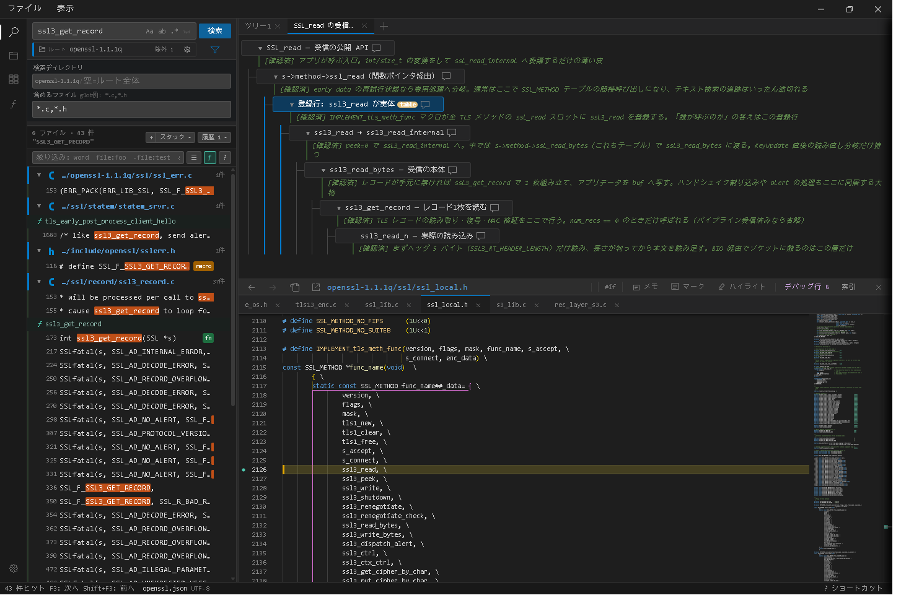

# grepnavi

[](https://github.com/Taka-S-dev/grepnavi/actions/workflows/test.yml)
[](https://github.com/Taka-S-dev/grepnavi/releases/latest)
[](LICENSE)

*A lightweight code-reading tool for large C codebases — ripgrep search, a Monaco-based source viewer, call trees and reference maps on top of GNU Global. No language server required — and it can serve as a lightweight one for your editor.*



C の大規模コードベース（Linux カーネル、OpenSSL、curl など）を読むためのコードリーディング（調査）ツール。ripgrep の高速検索 + VSCode と同じエディタ（Monaco）+ 調査グラフで、**「どこを調べたか」を記録しながら**構造を把握していきます。

clangd のような言語サーバを使える環境なら、精度はそちらのほうが上です。grepnavi が想定するのは**それが使えない・重すぎる環境**です — ビルドシステムが複雑で `compile_commands.json` を生成できない、PC のスペックが足りない、常駐のセキュリティソフトの下でインデックス作成がいつまでも終わらずエディタごと重くなる。そうした場面でも、検索・定義ジャンプ・呼び出し元の追跡が待たされずに動くことを優先しています。

> **ローカル専用ツールです**
> 自分の PC で起動して、同じ PC のブラウザからアクセスして使います。
> サーバーへのデプロイや、他の人が外部からアクセスできる環境での使用は想定していません。

---

## 特徴

### 検索

- **ripgrep 検索** — 正規表現・単語単位・glob。結果は逐次表示され、検索タブを 10 件まで並行保持
- **絞り込み** — 検索後に AND / OR / 除外 / `file:` `path:` でさらに絞る
- **関数セパレータ** — C の検索結果を所属関数ごとに区切る（「30 ヒットだが実は 2 関数」が一目で分かる）
- **シンボル検索** — 関数・構造体・マクロを名前のうろ覚えで（`recipe save` → `recipe_save`）
- **文字コード自動判定** — UTF-8 / Shift-JIS / EUC-JP / UTF-16 を自動検出、ワンクリックで切り替え再検索

### エディタ

- **ソースコードビューア（Monaco）** — VSCode と同じエディタで該当行へジャンプ。複数タブ
- **定義ジャンプ・参照・ホバー** — GNU Global の索引を優先し ripgrep へフォールバック。ホバーはマクロ展開と定数式の計算値つき
- **追跡ハイライト** — 単語を最大 8 色で、別ファイルを開いても追い続ける
- **#ifdef 可視化** — 条件コンパイルで無効になるブロックをグレーアウト。条件はリストで管理
- **行メモ・範囲メモ** — コードに書き込まずメモを残し、一覧からジャンプ
- **デバッグ行の管理** — printf 等を挿入して場所を記録、一覧から一括撤去。消し忘れは残数バッジで防ぐ。挿入欄も Monaco で、変数・構造体メンバーの補完と挿入先へのプレビューつき
- **C セマンティックハイライト** — static 変数・関数呼び出し・マクロの追加色付け

### 調査グラフ

- **ノードに積む** — 検索結果やエディタの選択をツリーへ積み、ラベル・メモ・カラーバッジで整理
- **呼び出し ↔ 実態の同期** — 呼び出し箇所に付けたメモが関数の実装行にも表示される
- **整理と保存** — D&D / キーボードで階層編集、複数ツリー、D3 グラフ表示、JSON 保存

### アドオン

- **コールツリー** — callers / callees をツリー表示。関数ポインタのテーブル登録も「誰が呼ぶか」の答えとして拾い、`ops->read()` のような経由呼び出しには印を付けて同名の別関数へ誤誘導しない
- **参照マップ** — どのまとまりがどの実装を使っているか、開いたことのないツリーでも全域を俯瞰（Linux カーネル実測: 初回 87 秒・以後 1 秒未満）
- **状態遷移図** — 状態変数への代入を集めて遷移図に。実線の辺だけがコードに根拠のある遷移
- **ジャンプマップ** — 定義ジャンプの足跡をグラフで可視化、draw.io へエクスポート
- **インクルード依存グラフ** — `#include` の依存を上流・下流に展開

### プロジェクト

- **ルートと調査 JSON の管理** — ルートごとに複数の調査ファイルを登録してワンクリック切り替え
- **対象から外す宣言** — `.gitignore` と同じ書き方で生成物などを検索・参照・ジャンプの全機能から除外
- **外部エディタ連携** — `{file}` / `{line}` プレースホルダで任意のエディタに接続
- **AI エージェント連携** — MCP ブリッジで Claude Code / Copilot CLI 等から調査グラフを構築（[mcp/README.md](mcp/README.md)）
- **エディタ連携（LSP・実験的）** — `-lsp` で Language Server として起動し、VSCode / Neovim に定義・型定義・実装へ移動、参照、同じ語のハイライト、ホバー、引数のヒント、呼び出し階層、補完、アウトライン、折りたたみを提供。索引は GUI と共有。関数ポインタのメンバは名前で別関数に解決せず、呼び出し階層では `(ptr)` と示し、「実装へ移動」では登録している行の一覧を返す（[docs/setup.md](docs/setup.md)）

各機能の挙動の細部・操作方法・制限・実測値は [docs/features.md](docs/features.md) を参照。

---

## 必要なもの

| 依存 | 必須 | 説明 |
|------|------|------|
| [Go](https://golang.org/) 1.25 以上 | — | ソースからビルドする場合のみ。バイナリ配布版は不要 |
| [ripgrep](https://github.com/BurntSushi/ripgrep) | ✅ | `rg` コマンドが PATH にあること |
| [GNU Global](https://www.gnu.org/software/global/) | 推奨 | **参照マップは Global の索引が必須**。定義ジャンプ・ホバー・Callers は索引で引くようになり、速く正確になる（実測: openssl の callers が 1.85 秒 → 0.05 秒）。無い場合は ripgrep の全ファイル走査で代用する |
| [Universal Ctags](https://github.com/universal-ctags/ctags) | 推奨 | **シンボル検索（ƒ パネル / Alt+Shift+T）と定数・マクロのハイライトは ctags の索引が必須**。定義ジャンプの精度も向上。索引の対象は C / C++ のみ |

---

## インストール・起動

### バイナリをダウンロード（推奨）

[GitHub Releases](https://github.com/Taka-S-dev/grepnavi/releases) からアーカイブをダウンロードして展開してください。Go のインストール不要です。

アーカイブの中身は次の 5 つです。

```
grepnavi/
├── grepnavi.exe    # コンソール版。ターミナルからフラグ付きで起動する
├── grepnaviw.exe   # ウィンドウ版。ダブルクリックでトレイ常駐する
├── static/         # UI 一式（Monaco 同梱）
├── README.md
└── LICENSE
```

> **注意：** `static/` フォルダを相対パスで参照するため、exe 単体では動作しません。アーカイブを展開したディレクトリごと配置してください。

### ソースからビルド

```bash
# ビルド
go build .
# → Windows: grepnavi.exe  Mac/Linux: grepnavi が生成されます

# ウィンドウ版（コンソールなし・ダブルクリックでトレイ常駐）
go build -ldflags "-H=windowsgui -X main.defaultTray=1" -o grepnaviw.exe .
```

アイコン（トレイ・exe・ウィンドウ・favicon で共用）は `rsrc_windows_amd64.syso` をリポジトリに含めているため、上記のビルドだけで exe に埋め込まれます。再生成の手順は [docs/setup.md](docs/setup.md) を参照。

### 起動

```bash
# 起動（カレントディレクトリを検索ルートとして使用）
.\grepnavi.exe          # Windows
./grepnavi              # Mac/Linux

# 起動時にルートを指定
.\grepnavi.exe -root C:\path\to\your\project
```

ブラウザが自動で開きます → http://localhost:8080

起動後もブラウザ上のルートチップ（左上）からディレクトリを変更できます。

#### デスクトップ（トレイ常駐）モード ※Windows のみ

```bash
.\grepnavi.exe -tray
```

システムトレイに常駐し、専用ウィンドウ（埋め込み WebView2）で開く。ブラウザ拡張機能の影響を受けない。ウィンドウは VSCode 風の一列バー（ファイル / 表示 メニュー + 窓ボタン）で、OS のタイトルバーを持たない。

起動フラグの一覧・デスクトップモードの操作詳細・別マシンからの SSH ポートフォワード利用は [docs/setup.md](docs/setup.md) を参照。

---

## 索引エンジン（オプション）

[GNU Global](https://www.gnu.org/software/global/) / [Universal Ctags](https://github.com/universal-ctags/ctags) を入れると、定義ジャンプ・ホバー・Callers・シンボル検索の精度が上がります（**どちらも無くても ripgrep で動作します**）。

エディタのファイルヘッダ右端の「索引」ラベルから生成・更新でき、状態（索引が古い / 索引なし）も同じ場所に表示されます。インストール手順（Scoop / `bin/` への直接配置）は [docs/setup.md](docs/setup.md) を参照。

---

## AI エージェント連携（オプション）

[MCP (Model Context Protocol)](https://modelcontextprotocol.io) ブリッジ `grepnavi-mcp` を経由して、AI エージェント（Claude Code / Copilot CLI 等）から grepnavi の調査グラフに直接ノードを追加できる。

AI に「`free_session()` の callers を 2 階層辿ってグラフに展開して」のように指示すると、AI が definition → graph_add_node → callers の連携で自動的にツリーを構築。grepnavi の GUI がリアルタイムで更新され、ブラウザのノードをクリック → エディタ該当行へジャンプして検証できる。

ブリッジは既定でソースコード read-only（memo / グラフのみ編集可）。grepnavi 側は外部プロセスからの API アクセスを許可するため `-mcp` フラグ付きで起動する。`-mcp-insert` を足すと AI がデバッグ行を撒いて撤去できるようになり、実機の出力からコードへ辿り直すところまで任せられる（AI が触れるのは自分が入れた行だけ。一覧に AI 印が付き、グループ単位でまとめて撤去できる）。

調査の進め方（どのツールをどの順で使うか、結果をどこまで信じてよいか）は [`mcp/skills/grepnavi/`](mcp/skills/grepnavi/) に Skill として分離してある。`cp -r mcp/skills/grepnavi ~/.claude/skills/` で有効化。入れなくても MCP 単体で動作する。

```bash
cd mcp
npm install
npm run build
./grepnavi -mcp
```

> ⚠️ **データ送信注意**: 仕組み上、AI エージェントは grepnavi から取得したファイル内容・検索結果・現在開いているファイルやカーソル位置を自身の AI サービス (Anthropic / GitHub 等) に送信する。機密コードを扱う場合は AI クライアントのデータ取り扱いポリシーを事前に確認すること。

セットアップ詳細・利用可能ツール一覧・トラブルシュートは [`mcp/README.md`](mcp/README.md) 参照。

---

## 使い方

### 基本的な流れ

1. 検索バーにパターンを入力して **検索** ボタン（または Enter）
2. 結果行をクリック → 右ペインのエディタでコードを確認
3. 気になった行の **+** ボタン（または Alt+Shift+G）でグラフにノード追加
4. F2 / 右クリックメニューでラベル・メモを編集してノードの意味を記録
5. ドラッグ&ドロップ or Shift+Alt+Arrow キーで親子関係・順序を整理
6. **Ctrl+S** でプロジェクトファイルに保存

キーボードショートカットの全表・`Ctrl+P` / `Alt+Shift+T` の検索記法・絞り込みの構文・ノードの移動操作は [docs/usage.md](docs/usage.md) を参照（アプリ内では `?` キーで同じ一覧が開きます）。


## アーキテクチャ

```
grepnavi/
├── main.go / server.go   # エントリーポイント・フラグ解析・HTTP サーバー初期化
├── api/                  # HTTP ハンドラ群（検索・グラフ・解析・索引・デバッグ行）
├── graph/                # 調査グラフのデータ構造・プロジェクトファイルの読み書き
├── search/               # 解析エンジン。ripgrep / GNU Global / ctags の統合、参照の解決規則、
│                         # 参照マップ、状態遷移の収集、#ifdef 評価、ホバー・マクロ計算、補完
├── patch/                # デバッグ行のファイル書き換え（既存行は照合してから、挿入行だけを書く）
├── proc/                 # 外部プロセス起動の共通層（セキュリティソフト環境向けの起動方式切り替え）
├── desktop/              # トレイ常駐と WebView2 ウィンドウ（自前タイトルバー）
├── tools/icongen/        # アイコン生成
├── lsp/                  # エディタ向け Language Server（-lsp）。search の薄いラッパで、stdio 専用
├── editors/vscode/       # LSP に接続する VSCode 拡張（ロジックは持たない）
├── mcp/                  # AI エージェント向け MCP ブリッジ（TypeScript）
├── test/                 # フロントエンドのテスト（node --test）
└── static/               # フロントエンド。vanilla JS + Monaco、ビルド工程なし
    ├── js/               # 検索・エディタ・グラフ・プロジェクト管理（機能ごとに1ファイル）
    ├── addons/           # コールツリー / 参照マップ / 状態遷移図 / ジャンプマップ / インクルード依存
    └── css/
```

フロントエンドはビルド工程を持たない素の JS で、`static/js/` を `index.html` から
順に読み込むだけ。リリースの `static/` も同じファイルをそのまま収めている。

API エンドポイントの一覧は [docs/api.md](docs/api.md) を参照。

---

## ライセンス

MIT
