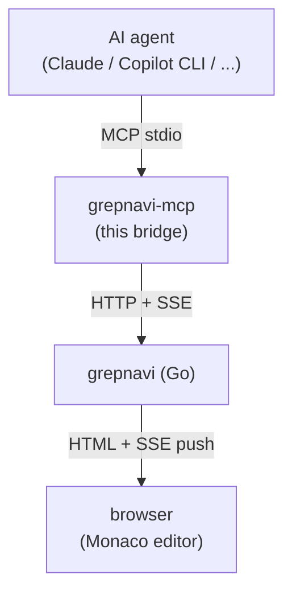

# grepnavi-mcp

[grepnavi](https://github.com/Taka-S-dev/grepnavi) の調査グラフに、AI エージェントから直接ノードを追加できるようにする MCP (Model Context Protocol) ブリッジ。

AI が `grepnavi_graph_add_node` を呼ぶと grepnavi の GUI がリアルタイムで更新され、ユーザはそのノードをクリックして Monaco エディタの該当 file:line にジャンプできる。ブリッジはコードベースに対して**読み取り専用**で、ソースファイルを編集することはない。

> ⚠️ **データ送信に関する注意**: このブリッジ自体は grepnavi (localhost) としか通信しない。しかしブリッジを呼び出す AI エージェント (Claude Code / Copilot CLI 等) は、ツール結果 (**ファイル内容・検索結果・関数本体・グラフメモ・現在開いているファイルやカーソル位置等**) を自身の AI サービス (Anthropic / GitHub / OpenAI 等) に送信する。機密コード・プロプライエタリなソースを扱う場合は、利用する AI クライアントのデータ取り扱いポリシーを事前に確認すること。
>
> `grepnavi_editor_state` を有効化すると、AI が呼び出すたびに現在開いているファイル名・カーソル位置・選択範囲・表示中の行範囲がメタデータとして AI サービスに送信される (ソース内容自体は `grepnavi_read_file` を別途呼ばないと送信されない)。

## アーキテクチャ



ブリッジは dumb pipe に徹する設計。ロジックはすべて grepnavi 本体側に置く。

## 提供ツール

### 探索系 (read-only)

| ツール | 役割 |
|---|---|
| `grepnavi_root` | grepnavi が現在開いているルートディレクトリの絶対パス + bridge version |
| `grepnavi_editor_state` | ブラウザ Monaco エディタの現在状態 (active file / cursor / selection / viewport) を返す。「この関数を説明して」「この範囲にメモ」のような指示を file:line 指定なしで処理するため。`fresh: false` (browser 切断 / 背景タブ / 操作なし 20 秒以上) のときは AI が user に確認する設計 |
| `grepnavi_read_file` | ファイル内容を取得 (SJIS / EUC-JP 自動 decode、相対パスは root 相対で解決、cat -n 形式) |
| `grepnavi_search` | 横断テキスト/正規表現検索 (encoding 自動 decode)。AI 自前 ripgrep の代替 |
| `grepnavi_func_body` | 関数本体を file+line から一発取得 (read_file の line 範囲推測が不要) |
| `grepnavi_symbols` | ファイル内の top-level シンボル一覧 (アウトライン) |
| `grepnavi_definition` | シンボル名 → file:line 解決 (gtags / ctags / ripgrep フォールバック)。各 hit に `engine` フィールド付き |
| `grepnavi_callers` | 関数を呼んでいる箇所一覧 (call tree を上に辿る、`depth` で再帰) |
| `grepnavi_callees` | 関数内から呼ばれている識別子一覧 + 各定義解決 (call_line, kind, engine, **`confidence`** (high/medium/low — low は silent failure 警告), likely_macro / likely_non_callable, self 自動除外、`depth` で再帰)。**`exclude_macros` / `exclude_non_callable` はデフォルト true** (ノイズ除去)。`excluded.macros` / `excluded.non_callable` は**名前リスト** で返す → 再 query 無しで「捨てたもの」を確認可能。definitions は path proximity で **top 1** のみ surface、`definitions_total` で件数通知 |
| `grepnavi_graph_list` | 既存ノード一覧 (id / label / file:line / memo / children) |

### グラフ編集系 (write)

| ツール | 役割 |
|---|---|
| `grepnavi_graph_add_node` | file:line をノードとして追加 (`memo` / `tags` / `badge_*` / `client_node_id` 同時指定可) |
| `grepnavi_graph_add_nodes` | **複数ノードを 1 call でバッチ追加**。`client_id` / `parent_client_id` で内部参照、bridge が topo-sort して親 → 子の順に POST。サブツリー丸ごとを 1 ショットで建てたい時に |
| `grepnavi_graph_set_memo` | 既存ノードの memo だけ差し替え |
| `grepnavi_graph_update_node` | label / memo / badge / line を任意組み合わせで更新 |
| `grepnavi_graph_delete_node` | ノード削除 (pin ミスの取り消し) |
| `grepnavi_graph_move_node` | 親付け替え (親 ID 空文字 = root 昇格) |

### 行・範囲 memo 系 (write)

調査グラフのノードとは別レイヤ。エディタの margin / hover に出る**行直接の注釈**。

| ツール | 役割 |
|---|---|
| `grepnavi_set_line_memo` | 単一行に memo (空文字で削除) |
| `grepnavi_set_range_memo` | 複数行範囲に memo (id 指定で既存差し替え) |
| `grepnavi_list_memos` | 現在の line/range memo 一覧取得 |

**ノード memo との使い分け**:
- ノード memo (`graph_add_node` の `memo` 引数): 調査ツリーの 1 件として残したい主張・発見
- 行/範囲 memo (`set_line_memo` / `set_range_memo`): ツリーに上げるほどでもないが、その場の注釈として残したい TODO・気づき

## セットアップ

前提:
- Node.js >= 18
- grepnavi がローカルで起動済み (デフォルト `http://localhost:8080`)

```bash
cd mcp
npm install
npm run build
```

## AI クライアントへの登録

### Claude Code (推奨: プロジェクトスコープ)

リポジトリ直下に `.mcp.json` が同梱されている。`grepnavi/` ディレクトリで Claude Code を起動すると初回に承認プロンプトが出るので、許可するだけ。設定ファイル編集不要。

`GREPNAVI_URL` (デフォルト `http://localhost:8080`) を変えたい場合は `.mcp.json` を編集。

### Copilot CLI / その他

ユーザスコープの MCP 設定に以下相当を追加:

```json
{
  "mcpServers": {
    "grepnavi": {
      "command": "node",
      "args": ["C:/absolute/path/to/grepnavi/mcp/dist/index.js"],
      "env": {
        "GREPNAVI_URL": "http://localhost:8080"
      }
    }
  }
}
```

## 使い方

### 基本フロー

1. **grepnavi を起動**してブラウザでプロジェクトを開く (`http://localhost:8080`)
2. **AI エージェント (Claude Code / Copilot CLI 等) を起動**。MCP 設定経由でブリッジが自動で立ち上がる
3. **AI に調査を依頼**する。例:
   ```
   ssl_init.c で SSL_CTX が初期化される経路を調べて、関連箇所をグラフに追加して
   ```
4. AI が `grepnavi_definition` で位置を解決し、`grepnavi_graph_add_node` で追加
5. **grepnavi のブラウザタブを見ると、ノードが即座に増えている**
6. ノードをクリック → Monaco エディタで該当行にジャンプ
7. 必要に応じて人手でメモ追記、ノード整理

### プロンプト例

**自律的なツリー展開** (callers/callees の使いどころ)
```
free_session() のルートノードを作って、そこから callers を 2 階層辿ってグラフに展開して。
各 caller には「呼び出し条件」を memo に書いて
```
→ AI が `graph_add_node` でルート作成 → `callers` で呼び出し元取得 → 各々をノード化 (parent_id で紐付け) → memo に文脈記録 → さらに 2 階層目を `callers` で取得

**バグ調査 + 注釈付け**
```
free_session() が二重に呼ばれていないか確認して、疑わしい呼び出し元をグラフに追加して、
怪しいものは memo に理由を書いて badge_color を赤にして
```
→ `callers` → `graph_add_node` (memo 同時設定) → `graph_update_node` で badge 強調

**アーキテクチャ把握**
```
ssl_lib.c の主要な公開関数を 5 つピックアップしてグラフに追加して。
ルートに「ssl_lib 把握」を作って、その下にぶら下げて。
各関数の memo には「何を担当しているか」を書いて
```
→ ルートノード作成 → 子ノード追加 (memo 同時) → ツリー構造でレビュー可能

**ミスの修正**
```
さっき作った XXX ノード、親が間違ってた。YYY の下に移動して
```
→ `graph_move_node` で `new_parent_id` 指定

### 動作確認

以下のレイヤごとに切り分け確認できる。エラー時は下の層から順に潰す。

#### レイヤ 1: grepnavi 本体の HTTP API

ブリッジを介さず直接叩く。

```powershell
# グラフ取得 (空でも OK、200 が返れば疎通成功)
curl http://localhost:8080/api/graph

# ノード追加 (file/line は任意、id は重複防止用に毎回変える)
curl -X POST http://localhost:8080/api/graph/node `
  -H "Content-Type: application/json" `
  -d '{\"match\":{\"id\":\"test0001\",\"file\":\"main.go\",\"line\":1,\"text\":\"package main\"},\"parent_id\":\"\",\"label\":\"smoke test\"}'
```

→ ブラウザタブで**新ノードが即座に出現**すれば SSE まで含めて OK。

#### レイヤ 2: SSE イベント単独

```powershell
curl -N http://localhost:8080/api/events
```

接続したまま別ターミナルでノード追加すると `event: graph.node_added` が流れてくる。

#### レイヤ 3: MCP ブリッジ単独 (stdio)

```powershell
node dist/index.js
```

stderr に `grepnavi-mcp ready (base=http://localhost:8080)` が出れば起動成功。

ツール一覧を取得する JSON-RPC を**そのまま stdin に貼る**:

```json
{"jsonrpc":"2.0","id":1,"method":"tools/list"}
```

→ 全ツール定義が JSON で返る。

ノード追加してみる:

```json
{"jsonrpc":"2.0","id":2,"method":"tools/call","params":{"name":"grepnavi_graph_add_node","arguments":{"file":"main.go","line":1,"label":"bridge smoke"}}}
```

→ レスポンスに `node_id` が含まれ、ブラウザに「bridge smoke」ノードが出現。

#### レイヤ 4: AI クライアント (Claude Code)

`grepnavi/` で `claude` 起動 → `.mcp.json` を承認 → 以下を投げる:

```
grepnavi_graph_list を呼んで現在のグラフを見せて
```

→ 既存ノードが listed されれば bridge ↔ Claude 間 OK。

```
main.go の line 1 を「Claude 経由テスト」のラベルでルートノードとして grepnavi に追加して
```

→ ブラウザに新ノード出現、Claude も `node_id` 報告。

#### トラブルシュート

| 症状 | 確認先 |
|---|---|
| ブラウザに反映されない | ブラウザ DevTools の Network で `/api/events` が pending か / `/js/events.js` が 200 か |
| `grepnavi-mcp ready` が出ない | `dist/index.js` が存在するか (`npm run build`) |
| Claude Code が `grepnavi` を認識しない | `.mcp.json` が repo 直下にあるか、再起動したか |
| ノード追加が 500 | grepnavi 側に project がロードされているか (root_dir 未設定だと AddNode が失敗するケースあり) |
| Claude Code MCP ログを見たい | `~/.cache/claude-cli-nodejs/*/mcp-logs-grepnavi/` (Linux/Mac) / Windows は `%LOCALAPPDATA%` 配下 |

### コツ

> tool description は意図的に簡潔に保ってあるので、運用 tip はここで補う。

- **ファイルを開く時は必ず `grepnavi_read_file`** を使うように AI に指示する。AI 自前の Read/Bash は CWD が grepnavi の root とズレてミスマッチを起こすし、SJIS / EUC-JP ファイルを正しく decode できない (この 2 つが「ノードに文字化けした memo が紛れ込む」問題の根本原因)
- **definition の sanity check pattern**: definition は稀に無関係な hit (gtags miss → ripgrep fallback がコメントを拾う等) を返すことがある。直後に `grepnavi_callees(word=...)` を呼ぶと bridge が `caller` を echo back する → そこで定義 pick と照合できる。一致しなければ `file` や `dir` で絞って再 query
- **path は definition / callers / callees が返した絶対パスをそのまま使う**。手で組んだ相対パスは nested checkout (`linux/linux/fs/...` のような構成) で root と二重に join され、誤った場所に解決される
- AI には先に `grepnavi_root` + `grepnavi_graph_list` を呼ばせて**現在のルートと既存ノードを把握**させると、パス指定ミスや重複追加が減る
- 追加先のツリーは grepnavi 側で**事前に切り替えておく** (AI は active tree しか触れない)
- AI が大量にノードを追加してきたら、grepnavi UI 側で**折り畳み**を活用して整理
- ノードに `tags` / `badge_color` を付けると後でグルーピング・色分けがしやすい (調査ツリーと行解説を混ぜたときの仕分けに有効)
- **サブツリー丸ごと作る時は `grepnavi_graph_add_nodes`** で 1 call にまとめる。`client_id` で親子関係を表現して、bridge に topo-sort を任せる
- **memo の `[未確認]` auto-prefix**: bridge が AI からの memo を全部 check して、verification tag (`[verified]` / `[確認済]` / `[読了]` / `[unverified]` / `[推測]` / `[未確認]` / `[未読]`) が無ければ自動で `[未確認]` を頭に付ける。AI が「読んで書いた」と主張するには明示的に `[verified]` または `[確認済]` を prefix する必要がある。GUI で `[未確認]` を見たら、**内容は AI の推測のため信用する前にコードを開いて確認する**こと
- **コールツリーを作る時は子ノードを「呼び出し行 (call site)」に置く**。`callees` の `definitions[0]` (callee の定義) ではなく、**caller の `file` + callee の `call_line`** を node 位置に使う。理由:
  - grepnavi の **call ↔ definition 同期**が起動し、call site に置いた memo が定義側でも見える (逆もしかり) → 双方向の発見性
  - クリックが**親と同じファイル内**で完結 → 引数や条件分岐など呼び出し文脈が保たれる
  - definition に置くと子ノードクリックでバラバラのファイルに飛ばされて起点を失う

### 既知の落とし穴

- **文字化け**: AI が SJIS / EUC-JP ソースを自前の file-read ツールで読むと、その時点で文字化けすることがある。破損したバイトをそのまま `graph_add_node.text` に渡すと grepnavi のツールチップにも文字化けが伝播する。対策はツール説明で「不安なら `text` を省略」と明示済み (省略すると grepnavi が file から自前で preview を取る)。
- **callees の `likely_macro` ヒント**: ブリッジが各 callee を `definition` で並列解決し、定義が見つからない / `kind=define` のみの場合に `likely_macro: true` を付ける。AI はこれが立っているものを skip またはマクロ専用枝に集めると、`IS_ERR` / `EXPORT_SYMBOL_GPL` 等のノイズに惑わされない。
- **callees の self 除外**: `word` を渡しておけば同名は自動で除外される (`excluded_self` カウントが結果に含まれる)。
- **`fetch failed` 単独で出てきたら**: ブリッジは `ECONNREFUSED` / `ENOTFOUND` / `ETIMEDOUT` を検出して原因コードと対処を表示する。それでも出ない場合は `GREPNAVI_URL` の port を疑う (デフォルト 8080)。
- **GUI と AI の memo 同時編集**: `/api/graph/memos` が**全置換 PUT** な性質上、AI が memo を書き、ほぼ同時刻に GUI でも別 memo を編集していると一方が消える race window がある。ブリッジは「現状 fetch → merge → PUT」で minimize、加えて server が `memos.updated` SSE を発火 → browser が即時 reload するので**最終状態は通常収束**する。ただし「AI が memo X を書く」と「GUI で memo Y を typing 中」が ms 単位で重なった場合は GUI のローカル変更が prefer される。
- **version mismatch**: grepnavi 本体や bridge を更新したら**両方とも再起動**する必要がある。bridge は古い `/api/callees` 形式 (`[]string`) も互換吸収するが、その場合 `call_line` が 0 で返る。更新時は `go build && 再起動` + `npm run build` + Claude Code 再起動の **3 ステップ**を忘れずに。

## 既知の制限

- **origin タグ無し**: SSE イベントは `POST /api/graph/node` のたびに発火する。ブラウザ自身の追加操作でも飛ぶため、ブラウザ側で `loadGraph` が 2 回走る (冪等なので動作上は無害)。
- **single instance 前提**: 1 ブリッジ = 1 grepnavi 想定。ポート違いの複数 grepnavi を切り替える場合は `GREPNAVI_URL` で対処。
- **ソースファイル read-only**: bridge は grepnavi 上の memo / グラフは編集できるが、ソースコードそのものには手を加えない。

## ライセンス

MIT (リポジトリルートの [LICENSE](../LICENSE) を参照)
